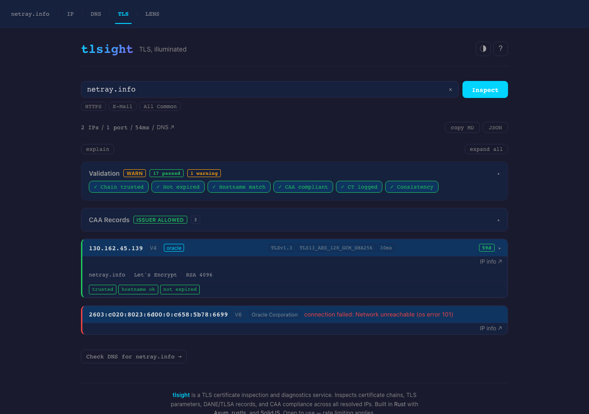
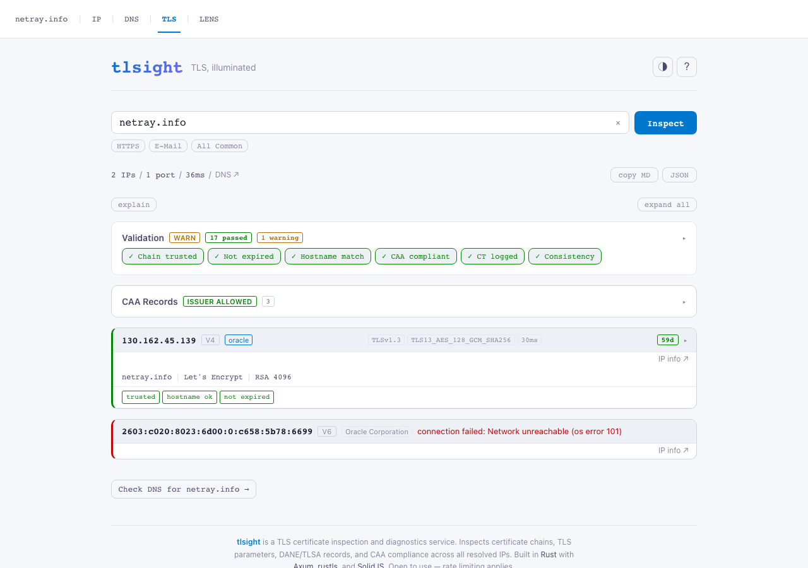
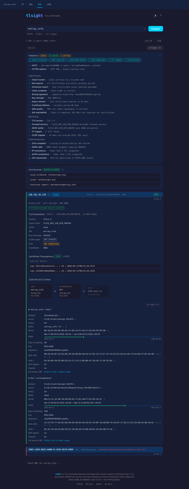

<div align="center">

# **tlsight** — TLS, illuminated

**Full certificate chain · Multi-IP consistency · DANE · CAA · OCSP · CT — in one request.**

[](https://tls.netray.info)
[](https://tls.netray.info/docs)
[](CHANGELOG.md)
[](LICENSE)

<br>

*Your browser hides broken certificates. This tool shows them all.*

<br>



<br>

</div>

---

## What it does

Type a hostname. tlsight resolves all its IPs, connects to each one, performs a full TLS handshake, and extracts everything worth knowing — in under two seconds.

- **Certificate chain** — leaf, intermediates, root; subject, SANs, key type, signature algorithm, expiry, fingerprints
- **TLS parameters** — version, cipher suite, key exchange group, ALPN, handshake time
- **OCSP stapling** — staple parsed if present; age and validity window shown
- **Certificate Transparency** — SCTs extracted from the TLS handshake extension
- **CAA compliance** — is the issuing CA actually authorized by your DNS CAA records? (155-entry compiled lookup table, no heuristics)
- **DANE/TLSA** — DNS-based certificate pinning, independent of the CA system
- **ECH detection** — queries HTTPS DNS record for Encrypted Client Hello advertisement
- **Multi-IP consistency** — detects cert mismatches, TLS version, cipher, and ALPN divergence across load-balanced servers
- **HSTS and HTTPS redirect** — live HEAD request to port 80 to verify security headers
- **STARTTLS** — auto-negotiated on SMTP ports 25 and 587 before the TLS handshake
- **22 graded health checks** — per-certificate, per-protocol, per-configuration, hostname-scoped

All of this from a single API call. No plugins. No browser extension. No configuration.

---

## Screenshots

*Inspecting [netray.info](https://tls.netray.info/?h=netray.info) — full chain, all checks, multi-IP.*

<table>
<tr>
<td width="50%">

**Dark theme**


</td>
<td width="50%">

**Light theme**



</td>
</tr>
<tr>
<td colspan="2">

**Expanded — full certificate chain and all checks**



</td>
</tr>
</table>

---

## Try it

**Browser** — [tls.netray.info](https://tls.netray.info)

```sh
# Full inspection — JSON
curl -s 'https://tls.netray.info/api/inspect?h=netray.info' | jq .

# Shareable URL
open 'https://tls.netray.info/?h=netray.info'

# Non-standard port
curl -s 'https://tls.netray.info/api/inspect?h=netray.info:8443'

# STARTTLS — SMTP
curl -s 'https://tls.netray.info/api/inspect?h=mail.example.com:25'

# Multiple ports side by side
curl -s 'https://tls.netray.info/api/inspect?h=example.com:443,465,993'
```

---

## Input syntax

```
hostname[:port[,port...]]
```

| Example | What it inspects |
|---|---|
| `example.com` | Port 443 |
| `example.com:8443` | Non-standard TLS port |
| `example.com:443,465,993` | HTTPS, SMTPS, and IMAPS side by side |
| `mail.example.com:25` | STARTTLS/SMTP — upgrade auto-negotiated |
| `mail.example.com:587` | STARTTLS/submission |

Maximum 7 ports per request. Internal IPs (RFC 1918, loopback, link-local, CGNAT) are blocked.

---

## API

### Inspect endpoint

```
GET /api/inspect?h=<hostname>
```

Returns a synchronous JSON response — TLS handshakes complete in milliseconds, no streaming needed.

```sh
curl -s 'https://tls.netray.info/api/inspect?h=example.com' | jq '{
  grade: .validation.verdict,
  expires_in: .ips[0].ports["443"].chain[0].days_remaining,
  tls_version: .ips[0].ports["443"].tls.version,
  cipher: .ips[0].ports["443"].tls.cipher_suite
}'
```

### Response shape (abbreviated)

```json
{
  "host": "example.com",
  "duration_ms": 412,
  "ips": [{
    "ip": "93.184.216.34",
    "enrichment": { "org": "Edgecast Inc.", "geo": "Los Angeles, US", "network_type": "hosting" },
    "ports": {
      "443": {
        "tls": { "version": "TLSv1.3", "cipher_suite": "TLS_AES_256_GCM_SHA384",
                 "key_exchange_group": "X25519", "handshake_ms": 98 },
        "chain": [{
          "subject": "CN=*.example.com",
          "issuer": "CN=DigiCert TLS RSA SHA256 2020 CA1",
          "not_after": "2025-11-15T12:00:00Z",
          "days_remaining": 142,
          "key_type": "RSA", "key_bits": 2048,
          "sans": ["*.example.com", "example.com"],
          "ct_scts": 2,
          "ocsp": { "stapled": true, "status": "good", "updated_ago_secs": 7200 }
        }],
        "checks": [
          { "name": "chain_trusted", "verdict": "pass" },
          { "name": "not_expired", "verdict": "pass" },
          { "name": "tls_version", "verdict": "pass" },
          { "name": "ocsp_stapled", "verdict": "pass" },
          ...
        ]
      }
    }
  }],
  "dns": {
    "caa": [{ "tag": "issue", "value": "digicert.com" }],
    "caa_compliant": true,
    "tlsa": [],
    "ech_advertised": false
  },
  "validation": { "verdict": "pass", "warnings": [], "skipped_ips": [] },
  "consistency": { "cert": true, "tls_version": true, "cipher_suite": true }
}
```

### Health checks

22 checks across four categories:

**Certificate** — `chain_trusted`, `not_expired`, `hostname_match`, `chain_complete`, `strong_signature`, `key_strength`, `expiry_window`, `cert_lifetime`

**Protocol** — `tls_version`, `forward_secrecy`, `aead_cipher`, `ocsp_stapled`, `ct_logged`

**Configuration** — `caa_compliant`, `dane_valid`, `ech_advertised`, `consistency`, `alpn_consistency`

**Hostname-scoped** — `hsts`, `https_redirect`

Each check returns `pass`, `warn`, `fail`, or `skip`. The `validation.verdict` is the worst result across all checks.

### CI / Pipeline integration

Gate deploys on TLS health:

```sh
# Fail if certificate expires in under 30 days
curl -s 'https://tls.netray.info/api/inspect?h=example.com' \
  | jq -e '.ips[0].ports["443"].chain[0].days_remaining > 30'

# Fail if any check is not passing
curl -s 'https://tls.netray.info/api/inspect?h=example.com' \
  | jq -e '.validation.verdict == "pass"'

# Full verdict summary
curl -s 'https://tls.netray.info/api/inspect?h=example.com' \
  | jq '{verdict: .validation.verdict, expires_days: .ips[0].ports["443"].chain[0].days_remaining}'
```

### Other endpoints

| Endpoint | Description |
|---|---|
| `GET /health` | Liveness probe |
| `GET /ready` | Readiness probe |
| `GET /api-docs/openapi.json` | OpenAPI 3.1 spec |
| `GET /docs` | Interactive API docs (Scalar UI) |

---

## Deployment

### From source

```sh
git clone https://github.com/lukaspustina/tlsight
cd tlsight
make
./target/release/tlsight tlsight.example.toml
# http://localhost:8081
```

### Configuration

Copy `tlsight.example.toml` and adjust:

```toml
[server]
bind = "0.0.0.0:8081"
metrics_bind = "127.0.0.1:9090"
# trusted_proxies = ["10.0.0.0/8"]
# custom_ca_dir = "/etc/tlsight/ca"   # PEM/CRT files for private CAs

[backends]
ip_url = "https://ip.netray.info"   # optional IP enrichment

[rate_limit]
per_ip_per_minute = 30
per_ip_burst = 5

[inspection]
max_ips_per_hostname = 10
max_concurrent_handshakes = 4
handshake_timeout_secs = 5
request_timeout_secs = 15
```

Override any value with `TLSIGHT_` env vars (`__` for nested sections): `TLSIGHT_SERVER__BIND=0.0.0.0:8081`.

**Custom CA support** — drop `.pem` or `.crt` files into `custom_ca_dir` to trust private CAs without a rebuild. Useful for internal PKI (Step-CA, Vault PKI, etc.).

### Build targets

```sh
make          # frontend + release binary
make dev      # cargo run with tlsight.dev.toml (port 8081)
make test     # all tests
make ci       # full gate: fmt, clippy, test, frontend, audit
make data     # refresh CAA issuer lookup table (data/caa_domains.tsv)
```

---

## Tech stack

**Backend** — Rust · Axum 0.8 · rustls (pure-Rust TLS) · x509-parser · mhost (DNS) · tokio · utoipa (OpenAPI 3.1) · rust-embed

**Frontend** — SolidJS 1.9 · Vite · TypeScript (strict)

**Part of** — [netray.info](https://netray.info) suite: [IP](https://ip.netray.info) · [DNS](https://dns.netray.info) · [HTTP](https://http.netray.info) · [Email](https://email.netray.info) · [Lens](https://lens.netray.info)

---

## License

MIT — see [LICENSE](LICENSE).
